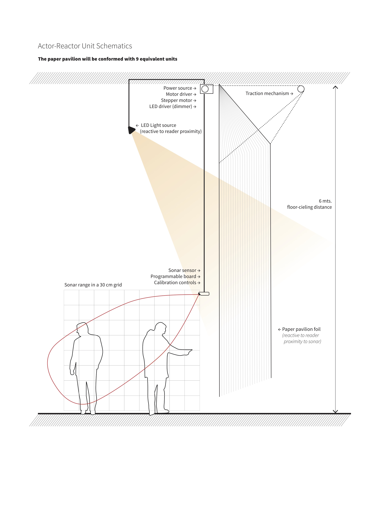

# actor-re-actor

This repository contains all relevant assets and information for building the **actor-re-actor** unit, a modular device designed for the Athens exhibit of Amereida, entitled **amereida phalène latin america**. There are 9 of these units.

This work was comissioned as part of the **documenta14** project and realized by the [http://amereida.cl](Open City Group) and [http://ead.pucv.cl](The Shcool of Architecture and Design e[ad], ) [http://www.pucv.cl](Pontificia Universidad Católica de Valparaíso).

### General Shcematics

### Components

1. Actuator Box
2. Sensor Box

### Artistic Statement

#### 9 Origins, 9 Principles

In this exhibition we ask ourselves for our origin. That is the way of making our content (logos) accessible and open to others, and it is a gesture of hospitality in the first place. Hospitality is a crucial dimension present, from the beginning, in the Open City. Far from being a rhetorical question, we ask ourselves genuinely: what is the sign of our origin? But, at the same time, recognize the multiplicity of this layered, vailed and manifold nature of our inquiry, in the same sense Aristotle warned us: “to on legetai pollachos”, The being is said in many ways; the being is manifold, multiple; it reveals itself in a multiplicity of manners.

The paper pavilion, as an exhibit, is structured upon the number nine (9). This number works as a given from the poetic word, and no further explanation is (or will be) provided. The number 9 presents itself as a structural totality (and starting point) that will allow us to start working in all that needs to be anticipated and planned relative to the project, all logistics that are required to be defined for this endeavor, but still leaving all the specifics open to be finally resolved in the act of actually building the pavilion. 9 is the way of keeping open that which must be closed.
 
These 9 units have a deep correspondence with all of our activities during our stay in Greece, since our work will be constituted from both 9 poetic acts and the pavilion itself. 9 questions, 9 phalènes, 9 places, 9 gods, 9 games, 9 references, 9 dimensions, etc. And by doing this, all “nines” are clustering in affinity with each other, creating 9 complex and equivalent units, each one developing its own idiosyncratic identity and line of inquiry. These nine are, in concrete, the nine pillars of the paper pavilion, the nine “detentions” for the reader, the nine spot lights for attention, the nine questions to be answered.

The paper foils are automated. There are nine sets of motors and sensors that will define the pavilion’s behavior relative to reader’s proximity, in a merely reactive fashion: no decision will be taken by any algorithm, only a reflex reaction. The paper foils will move as a shy and delicate being that bows in respect and recognition of another’s presence. This is the way in which we want to hardcode hospitality into the space, as a constant bowing and “giving space” to the reader.

Each unit is configured in such a way that if the reader moves closer to the surface, as if he or she wanted to read calmly and in detail, the paper foil will gently move away, as a mirage or an illusion (still reachable at a distance). The sensor placement works as the reference axis, as the (spatial) origin of the unit and will remain unaltered and fixed (anchored). From this referential axis we will hang and present an “original” reference taken from the archive. This configuration will create a relationship between a foreground object composed of a canonical reference and a background surface that will be fruit of the work we will bring from the phalènes (an apollonian figure against a dionysiac background). This relationship will be enhanced by the movement of the reader: the background will move away from the foreground as the point of view moves closer, in the same fashion as the cinematographic dolly-zoom technique, enhancing the tension between foreground (the canonical) and background (the emergent unknown).

The aggregation of these units conforming the pavilion will produce an overall behaviour that will echo the movement of the public, but the reaction will work only from the inside. This configuration will highlight the contrast between being inside and outside, were the people being inside will realize their participation in this ludic coupling between their movement with their surroundings. This will create a sense of complicity, since greater movements will only be achieved in coordination. The reverence of the space (which we earlier called the “bowing” in hospitality may change its character towards a spacing of space, a clearing in the Heideggerian sense of  the “ha lugar” of our poetic standpoint) All these behaviours are direct metaphors that beyond being a figurative gesture they present an autonomous and embodied version of the always-revealing nature of the origin we want to bring into a shared and celebrated presence.
